# CTF-Challenges | Capture The Flag Lab

## Overview
This is my fifth cybersecurity lab project — a set of self-designed CTF (Capture The Flag) challenges spanning web exploitation, reverse engineering, cryptography, forensics, and scripting. Rather than building this as a standalone island, the web challenge is deliberately **networked into the existing Network-Lab topology**, exploited over the real network from the Windows 10 client, and detected in real time by the Wazuh SIEM built in SIEM-Lab — closing a loop that Network-Lab, SIEM-Lab, and Honeypot-Lab's own "Next Steps" sections all pointed toward: a full attack chain, offense and defense, in one connected narrative.

An unplanned bonus reinforced this further: while transferring evidence between VMs using a temporary Python HTTP server, Wazuh independently flagged that activity as a high-severity potential data-exfiltration event — unscripted proof that the SIEM is watching broadly, not just reacting to the one exploit it was built to catch.

---

## Tools & Technologies
- **Virtualization:** VMware Workstation Pro (25H2)
- **Challenge Hosting:** Docker (web challenge containerized on Cowrie-Honeypot — no dedicated CTF platform VM)
- **Attacker:** Existing Windows 10 client (reused, no new VM)
- **Detection:** Existing Wazuh-Manager (from SIEM-Lab)
- **Recon:** Nmap
- **Challenge Tooling:** `gcc`, `strings`, Python (scapy, socket), Wireshark
- **Categories:** Web exploitation, reverse engineering, cryptography, forensics, scripting/automation

---

## Architecture

| Component | Detail |
|---|---|
| CTF Platform | Dropped a full platform (CTFd) in favor of Docker containers + direct documentation — less overhead, same learning value |
| Web challenge | Docker container on **Cowrie-Honeypot** (192.168.30.30:8080), VLAN30 |
| Attacker | Windows 10 client (192.168.20.10), VLAN20 |
| Detection | Existing Wazuh-Manager (192.168.30.20) — a custom rule was written specifically for this challenge's log output |

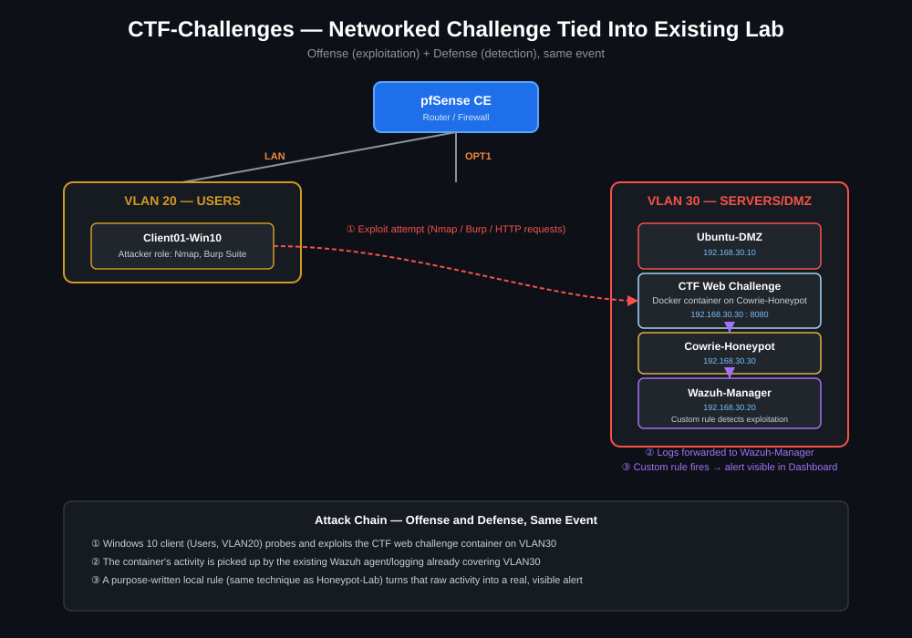

---

## Challenges

1. **Web Exploitation (networked):** A deliberately vulnerable Flask login app with a classic string-interpolated SQL injection, running in a Docker container on VLAN30. Exploited remotely from the Windows 10 client over the real network.
2. **Reverse Engineering:** A compiled C binary (`flag_checker`) hiding its real flag behind an XOR-encoded byte array, with a decoy flag planted for naive `strings` searches.
3. **Cryptography:** A message encrypted with a Vigenère cipher, solved by recovering the key (`LEMON`) through English-word-frequency scoring.
4. **Forensics/Networking:** A synthetic FTP session captured to a `.pcap` file, with the flag hidden as the cleartext login password — recovered via Wireshark's "Follow TCP Stream."
5. **Scripting:** A deliberately weak 3-digit PIN service with no rate limiting, solved by writing a brute-force script rather than guessing by hand.

---

## Setup Steps

### Reconnaissance and exploitation (Web Challenge)
1. Built and containerized the vulnerable Flask app (`docker build` / `docker run`), exposed on Cowrie-Honeypot at `192.168.30.30:8080`.
2. Verified the firewall path from Windows 10 with `Test-NetConnection 192.168.30.30 -Port 8080`.
3. Ran `nmap -sV 192.168.30.30 -p 8080` from Windows 10 — this generated real, distinct recon-phase log entries on the server (visible in the application logs as Nmap's HTTP service-detection probes), separate from the later exploitation attempts.
4. Exploited the login form with `' OR '1'='1' --` as the username, retrieving `flag{sql1_byp4ss_m4st3r}`.

### Local challenges
5. Compiled and solved the reverse-engineering challenge: extracted the decoy string with `strings`, then recovered the real flag by XOR-decoding the binary's embedded byte array with the key `0x5A`.
6. Generated and solved the cryptography challenge: recovered the Vigenère key via frequency-based scoring against a small wordlist.
7. Generated a synthetic FTP-session `.pcap`, transferred it to a machine with Wireshark, and recovered the flag from the cleartext FTP password via "Follow TCP Stream."
8. Ran the scripting challenge's vulnerable PIN service locally and solved it with a brute-force script trying all 1,000 combinations.

### Detection
9. Confirmed the exploitation traffic wasn't caught by any default Wazuh rule (expected — custom application traffic rarely matches built-in signatures).
10. Wrote a custom Wazuh rule matching the app's `SQLI_ATTEMPT` log marker, and a `<localfile>` entry forwarding Docker's container logs to the Wazuh agent (Docker logs to its own JSON file by default, not syslog — this needed an explicit config addition).
11. Verified the alert fired correctly in the Wazuh Dashboard, timestamped consistently with the actual exploitation attempt.
12. **Bonus finding:** while using a temporary Python HTTP server (`python3 -m http.server`) to transfer the forensics `.pcap` file between VMs for Wireshark analysis, Wazuh independently generated a separate high-severity alert (rule level 10) flagging the activity as potential data exfiltration — an unplanned but genuinely useful confirmation that detection coverage extends beyond the one scripted attack path.

---

## Screenshots / Proof

### Reconnaissance & Exploitation
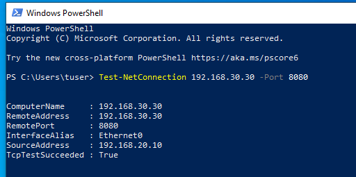
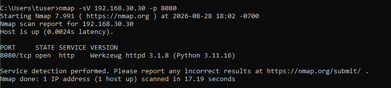
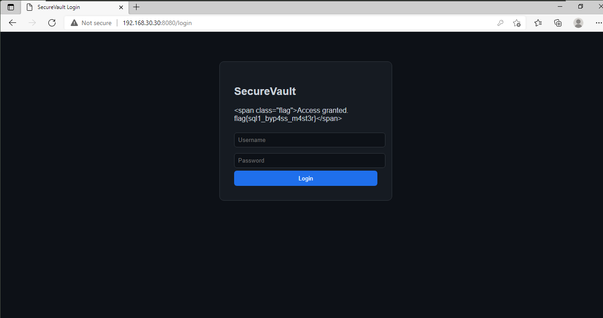

### Reverse Engineering
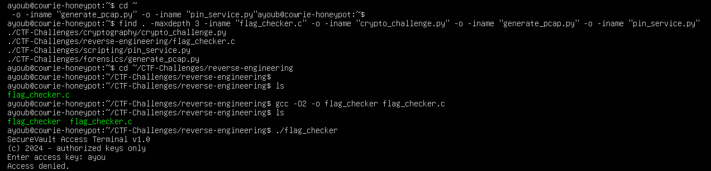

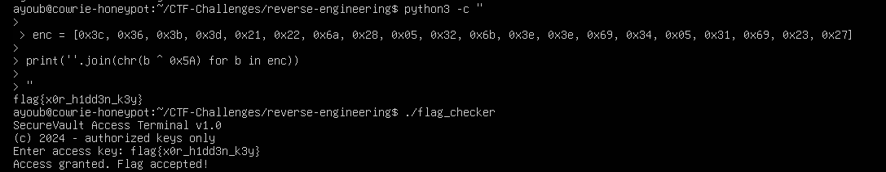

### Cryptography
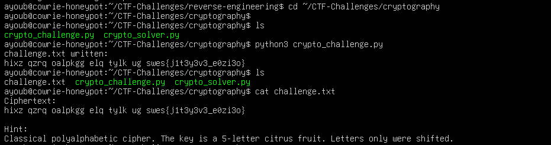
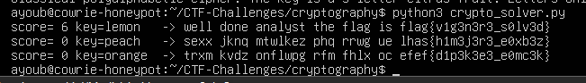

### Forensics
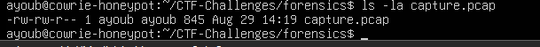
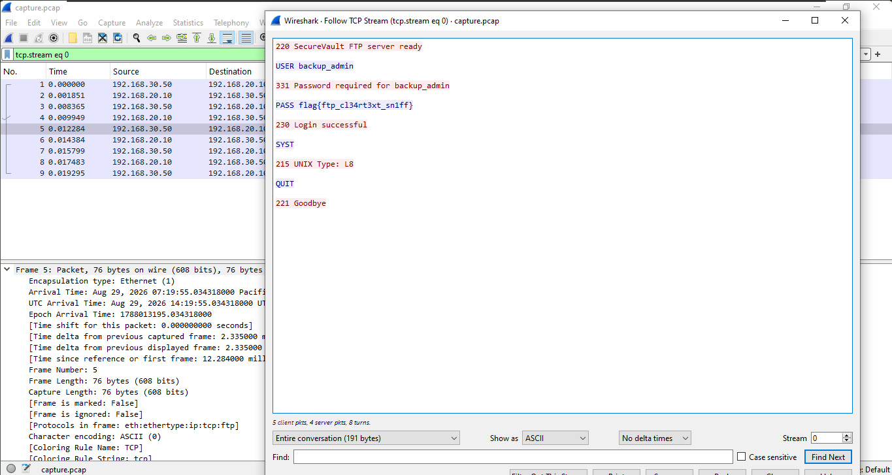

### Scripting
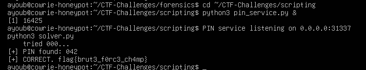

### Detection
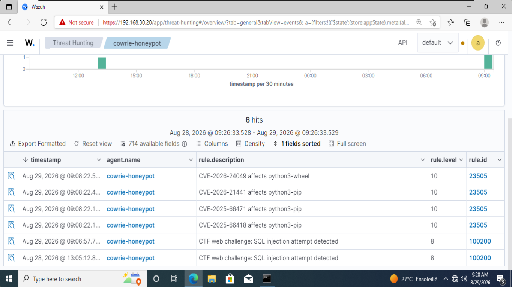

---

## Challenges (Project Difficulties)

- **CTFd was dropped in favor of a lighter approach.** A full platform (web app + database + user management) is real infrastructure to maintain for what is, in a solo portfolio context, largely presentation — Docker containers plus direct documentation deliver the same learning value at a fraction of the setup and resource cost.
- **Docker's own logging model created a silent detection gap.** The vulnerable app logs to stdout, which Docker captures in its own JSON log file rather than syslog — the default Wazuh agent config never sees this by default. Fixed with an explicit `<localfile syslog>` entry pointing at Docker's log path.
- **A compiler optimization stripped the reverse-engineering challenge's decoy string.** Building with `-O2` allowed GCC's dead-code elimination to remove the unreferenced `decoy` variable entirely, since `(void)decoy;` silences the unused-variable warning without actually forcing the compiler to retain it. Confirmed by rebuilding with `-O0`, which restored the string. The real flag-extraction path was unaffected either way, since it never depended on the decoy.
- **A stuck `unattended-upgrades` process blocked package installs mid-project** (the same recurring issue hit earlier in SIEM-Lab and Honeypot-Lab) — resolved the same way: identify and kill the process holding the APT lock, clear the lock files, and disable the automatic-update timers going forward.
- **The 8GB RAM host required strict VM rotation throughout** — never more than 3 VMs running simultaneously (pfSense + the VM being worked on + Windows 10 only when a browser or Windows-side action was actually needed), with a host crash partway through requiring a full status re-check of every running container and service before continuing.

---

## Learning Notes
- Designing a challenge requires understanding the vulnerability more deeply than just exploiting one — anticipating solver approaches, not just knowing one path through.
- Connecting an offensive exercise to existing defensive infrastructure (Wazuh) makes both sides concrete: an exploit isn't abstract when you can watch it become a real, timestamped alert seconds later.
- The bonus exfiltration alert was a genuine reminder that a SIEM's value isn't limited to the specific attack it was tuned for — broad log coverage catches things you weren't even testing for.
- Not every challenge needs network complexity: knowing when a challenge is better served staying simple and local (crypto, reverse engineering, forensics, scripting) versus when networking adds real value (the web challenge) is itself a design skill.
- Compiler behavior can silently affect a challenge's intended solve path — a good reminder to actually verify a built artifact matches what the source implies, rather than assuming it does.

---

## Next Steps
- Add a second networked challenge (e.g. a vulnerable service reachable only after chaining two exploits) for a more advanced attack-chain narrative.
- Package each local challenge as a portable Docker image others could pull and try themselves.
- Write a companion "detection engineering" note walking through exactly how the custom Wazuh rule was derived from the observed exploitation traffic, and formally document the bonus exfiltration-detection rule as an intentional part of the SIEM's coverage going forward.

---

**Author:** Ayoub Khachane

**Previous Projects:** [Network-Lab](https://github.com/ayoubkhachane/Network-Lab) · [SIEM-Lab](https://github.com/ayoubkhachane/SIEM-Lab) · [Honeypot-Lab](https://github.com/ayoubkhachane/Honeypot-Lab) · [Malware-Analysis](https://github.com/ayoubkhachane/Malware-Analysis)
